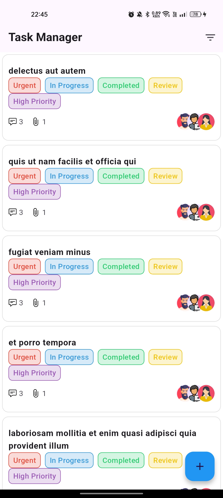

# How to Run the Flutter App

Follow these steps to run the Flutter app on your local machine:

## Prerequisites

1. Install **Flutter SDK** by following the [official guide](https://flutter.dev/docs/get-started/install).
2. Ensure you have a compatible **IDE** (e.g., Android Studio, Visual Studio Code) with the Flutter and Dart plugins installed.
3. Set up a **physical device** (with USB debugging enabled) or an **emulator/simulator**.

---

## Steps to Run the App

1. Open a terminal and navigate to the project's root directory.
2. Fetch all dependencies by running:
   ```bash
   flutter pub get
3. build and run flutter app
    ```bash
    flutter run


# Task Manager App

This app helps managers monitor tasks assigned to employees, providing real-time updates and efficient task management.

## Screenshot

<div style="display: flex; justify-content: space-around;">

  
  
  

</div>

---


## Features

- **Task Monitoring**: Easily track tasks, comments, and assigned members.
- **Real-Time Updates**: Uses streams for real-time changes to tasks and updates in the UI.
- **Optimized Data Fetching**: Fetches only relevant data using user-specific keys, reducing network load.
- **Robust Error Handling**: All network operations are wrapped in `try-catch` blocks to handle errors gracefully.

---

## Approach

1. **Data Model**
   - **Todo Model**:
     - `title` (String): The task title.
     - `tags` (Map): A mapping of tags to their respective colors for visual categorization.
     - `comments` (Model): Includes:
       - `comment` (String): The comment text.
       - `commentor` (String): The author of the comment.
       - `createdOn` (DateTime): Timestamp of the comment.
     - `members` (List): Members assigned to the task with a boolean to indicate task completion.
     - `manager` (String): Creator of the task, responsible for CRUD operations.

2. **UI and Data Handling**
   - Tasks are fetched from an API and displayed using a `ListView.builder`.
   - Stream-based implementation ensures real-time updates to the task list.

3. **Error Handling**
   - All network operations are encapsulated in `try-catch` blocks for reliability under various conditions.

---

## How It Works

1. Tasks are created and managed by the **manager**.
2. Assigned **members** can update the status of their tasks.
3. **Comments** can be added to discuss progress or issues.
4. Tasks are visually distinguished by **tags** with color-coded palettes.

---

## Technologies Used

- **Flutter**: For building the app.
- **Streams**: To handle real-time data updates.
- **API Integration**: Fetches and syncs task data with the server.

---

## Notes

This app is designed with scalability and performance in mind, ensuring efficient task management for teams of any size.
